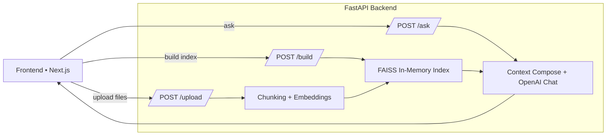

# RAG Web Chat — OpenAI + FastAPI + Next.js

A minimal Retrieval-Augmented Generation (RAG) app:

- Backend API: **FastAPI** with **FAISS** vector search  
- Frontend: **Next.js (App Router)** with a clean dark UI  
- Embeddings: **OpenAI `text-embedding-3-large`**  
- Answers: **OpenAI `gpt-4o-mini`**


---

##  Features

- Upload many files: **PDF, TXT, MD, DOCX, DOC**
- Build an in-memory FAISS index and query across **all** uploaded docs
- Clean dark UI with centered panel and gradient buttons
- **Sources** on the left, **Answer** on the right
- Fixed **“How to use”** button → modal guide (upload → build → ask)
- Personal branding: vertical **LinkedIn** and **GitHub** round icons
- Simple API: `/upload`, `/build`, `/ask`, `/reset`

> `.doc` parsing uses `textract` if present; otherwise it’s skipped (you can still use `.docx`).

---

## 🧭 Architecture



---

##  Repo Structure

```
server/
  app.py
  requirements.txt
  .env            # not committed; for your OpenAI key
web/
  app/
    layout.tsx
    page.tsx
    globals.css
  package.json
  next.config.js
  .env.local      # not committed; frontend config (API URL + social links)
```

---

##  Quick Start (Local)

### 1) Backend (FastAPI)

**Prereqs**: Python 3.10+, pip

```bash
cd server
python -m venv .venv
# Windows PowerShell: .\.venv\Scripts\Activate.ps1
# macOS/Linux:
. .venv/bin/activate

pip install -r requirements.txt

# set your OpenAI key (must start with sk-)
# Windows PowerShell:
$env:OPENAI_API_KEY="sk-xxxxxxxxxxxxxxxx"
# macOS/Linux:
export OPENAI_API_KEY=sk-xxxxxxxxxxxxxxxx

uvicorn app:app --reload --host 0.0.0.0 --port 8000
```

### 2) Frontend (Next.js)

**Prereqs**: Node 18+

```bash
cd web
npm i

# edit web/.env.local:
# NEXT_PUBLIC_API_URL=http://localhost:8000
# NEXT_PUBLIC_LINKEDIN_URL=https://www.linkedin.com/in/your-handle
# NEXT_PUBLIC_GITHUB_URL=https://github.com/your-handle

npm run dev
# visit http://localhost:3000
```

---

##  How to Use (in the UI)

1. **Upload** your files (PDF/TXT/MD/DOCX/DOC)  
2. Click **Build Index** to process and index  
3. Ask your questions — the model will answer and cite **Sources** on the left

The “How to use” button in the footer shows this guide in-app.

---

##  Environment Variables

**Backend** (`server/.env` or shell env):
```
OPENAI_API_KEY=sk-...   # required
```

**Frontend** (`web/.env.local`):
```
NEXT_PUBLIC_API_URL=http://localhost:8000
NEXT_PUBLIC_LINKEDIN_URL=https://www.linkedin.com/in/your-handle
NEXT_PUBLIC_GITHUB_URL=https://github.com/your-handle
```

> Do **not** expose your `OPENAI_API_KEY` to the frontend. The key is used only by the server.

---

##  API Endpoints

| Method | Path     | Body                                          | Response (200)                                   |
|:------:|----------|-----------------------------------------------|--------------------------------------------------|
| POST   | `/upload`| `multipart/form-data` with `files[]`          | `{ status, files, chunks_added, total_chunks }`  |
| POST   | `/build` | none                                          | `{ status, chunks }`                             |
| POST   | `/ask`   | `{ "question": "string", "top_k": number? }`  | `{ status, answer, sources:[{id,file,preview}]}` |
| POST   | `/reset` | none                                          | `{ status }`                                     |

**Answer formatting**: The backend composes a prompt from top-K chunks and asks OpenAI for a concise answer with inline citations like `[1][3]`.

---

##  Notes & Troubleshooting

- **DOC parsing** on Windows:
  - If `pip` errors on `textract==1.6.5`, pin to `textract==1.6.4` or install with `pip<24.1`.
  - If `.doc` still fails, convert to `.docx` and upload.
- **Scanned PDFs** need OCR; text extraction may be empty.
- **CORS** is open to `*` for local dev; restrict in production.
- **Memory**: Index is in RAM. Large corpora consume more memory. For production, consider FAISS persistence.

---

##  Roadmap (Next Steps)

- Streaming answers (SSE)
- On-disk index persistence + reload
- Duplicate chunk dedup (hashing)
- Hybrid search (BM25 + vectors) with MMR rerank
- Token/cost usage display in UI
- Unit tests and GitHub Actions CI
- Deploy guides (Vercel frontend + small VM/Railway backend)

---

##  Contributing

Issues and PRs are welcome. Keep features small and focused.

---
##  Credits

- [FastAPI](https://fastapi.tiangolo.com/)
- [FAISS](https://github.com/facebookresearch/faiss)
- [Next.js](https://nextjs.org/)
- [OpenAI Python SDK](https://github.com/openai/openai-python)
